# Audience Survey - Architecture Diagram

## System Architecture

```mermaid
graph TB
    subgraph "Users"
        Admin[👤 Admin<br/>Session Management]
        Attendee[👥 Attendees<br/>Survey Upload]
    end

    subgraph "Azure Front Door CDN"
        FrontDoor[🌐 Front Door Endpoint<br/>Global CDN - 118 PoPs<br/>Cache & Compression]
    end

    subgraph "Azure Container Apps"
        WebApp[🚀 Next.js App<br/>Container App<br/>Port 3000]
        
        subgraph "API Routes"
            AnalyzeAPI[📤 POST /api/analyze<br/>Upload & Process]
            SummaryAPI[📊 GET /api/summary<br/>Aggregated Results]
            SessionAPI[🔑 /api/sessions<br/>Session CRUD]
        end
        
        DataStore[💾 DataStore Singleton<br/>In-Memory Storage<br/>Sessions & Results]
    end

    subgraph "Azure Storage"
        BlobStorage[📦 Blob Storage<br/>Container: uploads<br/>Survey Images]
    end

    subgraph "Azure AI Services"
        ContentUnderstanding[🧠 Content Understanding<br/>Custom Analyzer<br/>audience-survey]
        AIFoundry[🎯 AI Foundry Project<br/>Optional Connection<br/>Advanced AI Features]
    end

    subgraph "Azure Security"
        KeyVault[🔐 Key Vault<br/>Secrets Management<br/>- API Keys<br/>- Admin Secret<br/>- Connection Strings]
        ManagedIdentity[🎫 Managed Identity<br/>User-Assigned<br/>Passwordless Auth]
    end

    subgraph "Container Registry"
        ACR[📦 Container Registry<br/>Docker Images<br/>GitHub Actions Deploy]
    end

    %% User Interactions
    Admin -->|Login & Manage| FrontDoor
    Attendee -->|Upload Photo| FrontDoor
    
    %% CDN to App
    FrontDoor -->|HTTPS<br/>Cache Miss| WebApp
    
    %% API Flow
    WebApp --> AnalyzeAPI
    WebApp --> SummaryAPI
    WebApp --> SessionAPI
    
    %% Session Management
    SessionAPI <--> DataStore
    
    %% Document Processing Flow
    AnalyzeAPI -->|1. Check Active Session| DataStore
    AnalyzeAPI -->|2. Upload Image| BlobStorage
    AnalyzeAPI -->|3. Analyze Image Buffer| ContentUnderstanding
    ContentUnderstanding -->|4. Extracted Fields| AnalyzeAPI
    AnalyzeAPI -->|5. Store SurveyResult| DataStore
    
    %% Dashboard Flow
    SummaryAPI -->|Query Aggregations| DataStore
    DataStore -->|Session Summary| SummaryAPI
    SummaryAPI -->|JSON Response| WebApp
    WebApp -->|Render Dashboard| FrontDoor
    FrontDoor -->|Cached Response| Admin
    
    %% Security & Identity
    ManagedIdentity -.->|Access Secrets| KeyVault
    ManagedIdentity -.->|Upload/Download| BlobStorage
    ManagedIdentity -.->|Pull Images| ACR
    WebApp -.->|Uses Identity| ManagedIdentity
    KeyVault -.->|Provides Credentials| WebApp
    
    %% Optional AI Foundry Connection
    ContentUnderstanding -.->|Optional<br/>Connection| AIFoundry
    
    %% Deployment
    ACR -->|Image Pull| WebApp

    %% Styling
    classDef azure fill:#0078D4,stroke:#004578,color:#fff
    classDef storage fill:#7FBA00,stroke:#5C8700,color:#fff
    classDef ai fill:#FF6C00,stroke:#C44E00,color:#fff
    classDef security fill:#FFB900,stroke:#D99000,color:#000
    classDef user fill:#50E6FF,stroke:#00BCF2,color:#000
    classDef cdn fill:#E81123,stroke:#A4262C,color:#fff
    
    class WebApp,AnalyzeAPI,SummaryAPI,SessionAPI azure
    class BlobStorage,DataStore storage
    class ContentUnderstanding,AIFoundry ai
    class KeyVault,ManagedIdentity security
    class Admin,Attendee user
    class FrontDoor,ACR cdn
```

## Document Processing Flow (Detailed)

```mermaid
sequenceDiagram
    participant A as 📱 Attendee
    participant FD as 🌐 Front Door CDN
    participant API as 🚀 Next.js API
    participant DS as 💾 DataStore
    participant Blob as 📦 Blob Storage
    participant CU as 🧠 Content Understanding
    participant Dash as 📊 Dashboard

    Note over A,Dash: Survey Upload & Processing Flow

    A->>FD: Upload survey photo (FormData)
    FD->>API: POST /api/analyze
    
    API->>DS: Check active session
    alt No Active Session
        DS-->>API: null
        API-->>A: ❌ 400 Error: No active session
    else Session Active
        DS-->>API: ✅ Active session found
        
        API->>API: Validate file (type, size)
        
        API->>Blob: Upload image buffer
        Blob-->>API: Blob URL
        Note over Blob: Image stored at:<br/>timestamp-uuid.jpg
        
        API->>CU: POST analyze endpoint (image buffer)
        CU->>CU: Start analysis job
        CU-->>API: Operation location header
        
        loop Poll every 2 seconds (max 120s)
            API->>CU: GET operation-location
            CU-->>API: Status: running/succeeded/failed
        end
        
        CU-->>API: ✅ Extracted fields JSON
        Note over CU: Fields extracted:<br/>- Attendee Type<br/>- AI Level<br/>- Ratings (1-5)<br/>- NPS (0-10)<br/>- Text feedback
        
        API->>API: Map Azure response to SurveyResult
        Note over API: Add blob URL to result
        
        API->>DS: Store SurveyResult
        DS-->>API: Success
        
        API-->>A: ✅ 200 Success + confetti 🎉
    end

    Note over A,Dash: Dashboard Real-Time Update

    Dash->>FD: Poll GET /api/summary?sessionId=xxx
    FD->>API: Cache miss → forward request
    API->>DS: getSessionSummary(sessionId)
    
    DS->>DS: Aggregate all survey results:<br/>- Calculate averages<br/>- Count distributions<br/>- Extract keywords<br/>- Compute NPS
    
    DS-->>API: SessionSummary JSON
    API-->>FD: JSON response (no cache)
    FD-->>Dash: Display updated charts
    
    Note over Dash: Updates every 3-5 seconds:<br/>- Live submission count<br/>- NPS score<br/>- Feedback charts<br/>- Word cloud
```

## Key Architecture Components

### 1. **Global CDN Layer** (Azure Front Door)

- **Purpose**: Low-latency global access, caching, compression
- **Performance**: 50-100ms TTFB (cached) vs 400-500ms (origin)
- **Coverage**: 118+ Points of Presence worldwide
- **Cache Strategy**: Ignores `utm_*` query params, caches static assets

### 2. **Application Layer** (Container Apps)

- **Runtime**: Next.js 16 App Router in Docker container
- **Scaling**: 0.5 vCPU, 1GB RAM, 1-2 replicas (auto-scale)
- **Authentication**: Managed identity (passwordless to Azure services)
- **Health Check**: GET / endpoint (polled every 100s by Front Door)

### 3. **Storage Layer**

- **In-Memory**: DataStore singleton (resets on restart)
- **Blob Storage**: Persistent image storage with 7-day retention
- **Future**: Replace DataStore Maps with database for production persistence

### 4. **AI Processing** (Content Understanding)

- **Custom Analyzer**: `audience-survey` analyzer with predefined schema
- **API Version**: `2025-05-01-preview`
- **Flow**: Async polling (2s intervals, 120s timeout)
- **Input**: Raw image buffer (JPEG/PNG/WebP)
- **Output**: Structured JSON with extracted survey fields

### 5. **Security Layer**

- **Key Vault**: Centralized secret management
- **Managed Identity**: User-assigned identity for Container App
- **Roles**: `AcrPull`, `Storage Blob Data Contributor`, `Key Vault Secrets User`
- **Admin Auth**: Secret-based login (stored in Key Vault)

### 6. **Deployment Pipeline**

- **GitHub Actions**: Builds Docker image on push to main
- **Container Registry**: Stores versioned images (tagged with commit SHA)
- **Terraform**: Infrastructure as Code for all Azure resources
- **Update Strategy**: Blue/green deployment via Container App revisions

## Data Flow Summary

1. **Attendee uploads photo** → Front Door CDN → Next.js API
2. **API validates** → Checks active session in DataStore
3. **Image uploaded** → Azure Blob Storage (persistent)
4. **AI analysis** → Content Understanding extracts structured data (2-step: start + poll)
5. **Results stored** → DataStore in-memory (with blob URL reference)
6. **Dashboard polls** → GET /api/summary aggregates all results
7. **Live updates** → Dashboard refreshes every 3-5 seconds showing real-time feedback

## Infrastructure Cost Breakdown

| Component | Tier | Monthly Cost |
|-----------|------|-------------|
| Azure Front Door | Standard | $50-75 |
| Container Apps | 0.5 vCPU, 1GB RAM | $25-35 |
| AI Services (Content Understanding) | S0 | $10-30 |
| Storage + ACR + Logs + Key Vault | Standard | $10-15 |
| **Total** | | **$100-150** |

**Cost Optimization**: Remove Front Door for direct access (-$55/month) or scale down to 0.25 vCPU with min replicas = 0 (-$12/month).

## Deployment URLs

- **Production (CDN)**: `https://audsurvey-endpoint-<suffix>-<hash>.z03.azurefd.net`
- **Direct (West US)**: `https://audsurvey-app-<suffix>.thankfulwater-<hash>.westus.azurecontainerapps.io`

Use CDN URL for production traffic, direct URL for debugging only.
